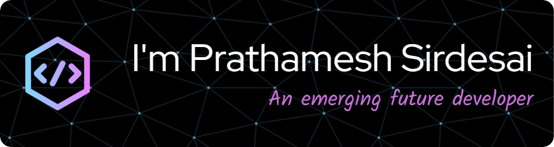

<h1 align="center">Hey there 👋 I'm Prathamesh Sirdesai</h1>
<h3 align="center">An emerging future developer</h3>

- 😎 I'm intrested in Web Development
- 🎮 Currently learning Web3 & Unity
- 📩 Contact me at @sirdesai.work@gmail.com
<h3>Connect with me on</h3>

  
  <!--  -->

